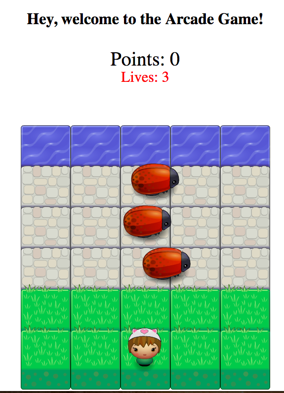

# Memory Game Project

For this project, I am building an Arcade Game.
The starter project has some HTML and CSS styling and JS for the main Engine. 

I am making the player and enemies move and interact in the canvas. 

Please click [here](https://bamby-arcade-game.netlify.com/) to be redirected to the website. 

# Technologies

* HMTL
* CSS
* JAVASCRIPT

# Launch

 The project does not have minimum hardware requirements.
 Just view the HTML Page in Your Browser.
 Please click [here](https://bamby-arcade-game.netlify.com/) to be redirected to the website.

# How to play
 In this game you have a Player and Enemies (bugs). The goal of the player is to reach the water, without colliding into any one of the enemies.
 
The player can move left, right, up and down
The enemies move at varying speeds on the paved block portion of the game board
Once a the player collides with an enemy, the game is reset and the player moves back to the starting square.

Once the player reaches the water (i.e., the top of the game board), the game is won. 

The player has 3 lives.
The player loses one life everytime he/she collides with and enemy! 

When winning the player earn an extra life! 

 # Contributing 

This project was written by Bamby Gassama inspired by Udacity Nanodegree 3nd project assignment. 

# Licence
The MIT License (MIT)

Copyright (c) 2019 Bamby Gassama

Permission is hereby granted, free of charge, to any person obtaining a copy
of this software and associated documentation files (the "Software"), to deal
in the Software without restriction, including without limitation the rights
to use, copy, modify, merge, publish, distribute, sublicense, and/or sell
copies of the Software, and to permit persons to whom the Software is
furnished to do so, subject to the following conditions:

The above copyright notice and this permission notice shall be included in all
copies or substantial portions of the Software.

THE SOFTWARE IS PROVIDED "AS IS", WITHOUT WARRANTY OF ANY KIND, EXPRESS OR
IMPLIED, INCLUDING BUT NOT LIMITED TO THE WARRANTIES OF MERCHANTABILITY,
FITNESS FOR A PARTICULAR PURPOSE AND NONINFRINGEMENT. IN NO EVENT SHALL THE
AUTHORS OR COPYRIGHT HOLDERS BE LIABLE FOR ANY CLAIM, DAMAGES OR OTHER
LIABILITY, WHETHER IN AN ACTION OF CONTRACT, TORT OR OTHERWISE, ARISING FROM,
OUT OF OR IN CONNECTION WITH THE SOFTWARE OR THE USE OR OTHER DEALINGS IN THE
SOFTWARE.
